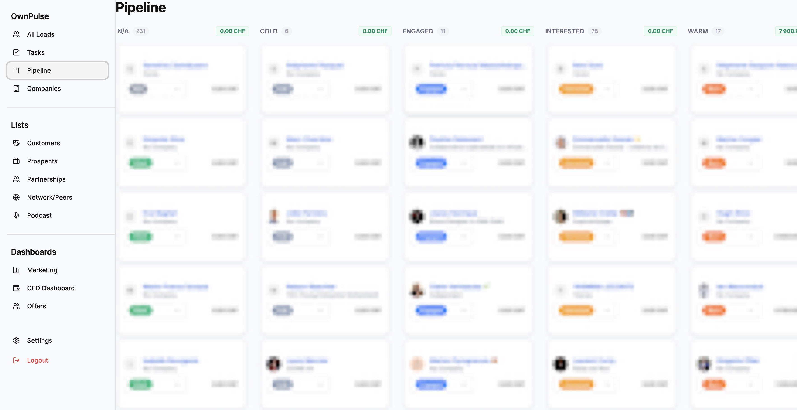
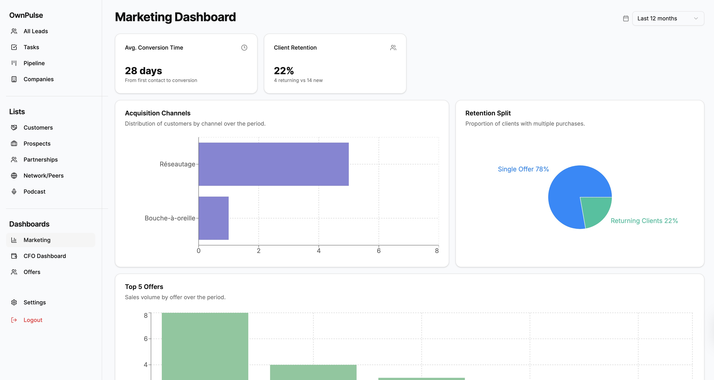
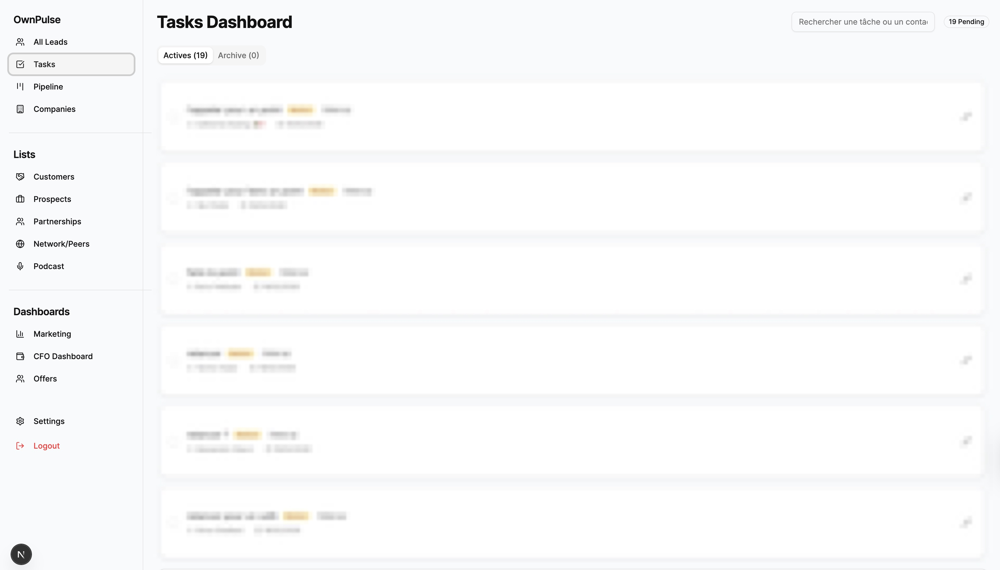

# 🛰️ OwnPulse
### **The Ultimate Pilot Tool for Solopreneurs: Social CRM, Marketing, and Financial Intelligence**





*Built by [Cedric V.](https://cedricv.com/en/) — architecting lightweight, sovereign systems for modern entrepreneurs.*

---

**OwnPulse** is the **ultimate tool for solopreneurs to pilot their business**. It provides a centralized, private view of your business growth and health, bridging the gap between **lead acquisition**, **marketing performance**, and **financial sustainability**.

---

## ✨ Core Pillars

### 1. ⚡ Sovereign Social CRM
- **Smart Capture:** Instantly save leads from **LinkedIn, Threads, and Instagram** via the dedicated Chrome Extension.
- **Pipeline Management:** Move leads through custom stages with a high-velocity, debounced interface.
- **Bi-directional Linking:** Connect sales directly to contacts for a 360° view of customer history.

### 2. 📊 Marketing & Offer Intelligence
- **Acquisition Analysis:** Track exactly which social channels are driving your customers.
- **Conversion Velocity:** Measure the *time-to-conversion* from first contact to first sale.
- **Offer Mastery:** Manage complex service offers with integrated work-time calculators and automatic margin tracking.
- **Profitability Dashboard:** Visualize real vs. theoretical hourly rates and sales goals progress per offer.
- **Retention Tracking:** Visualize returning vs. new customer ratios to optimize long-term growth.

### 3. 💰 Financial Command (CFO Dashboard)
- **Revenue vs. Reality:** Track total sales against professional expenses and **actual remuneration**.
- **Net Profit Simulation:** Real-time visibility into your *true* margin after social contributions and taxes.
- **Runway Analysis:** Know exactly how many months of operation you have left based on current cash flow.

## 🛠️ Tech Stack
- **Frontend/Backend:** [Next.js 16](https://nextjs.org/) (App Router, Turbopack)
- **Database:** [Supabase](https://supabase.com/) (PostgreSQL, Real-time sync, Row-Level Security)
- **Styling & Components:** [Tailwind CSS](https://tailwindcss.com/) + [Shadcn UI](https://ui.shadcn.com/)
- **i18n:** Custom localized experience (FR/EN) with persistent settings.
- **Extension:** Chrome Manifest V3 for secure DOM scraping.
---

## 🚀 Getting Started

### 1. Database Setup (Supabase)
1. Create a free project on [Supabase](https://supabase.com).
2. Execute the SQL schema found in `/supabase/schema.sql` to initialize your `contacts`, `companies`, and `tasks` tables.
3. Retrieve your `SUPABASE_URL` and `SUPABASE_ANON_KEY`.
4. *Existing users:* If you are upgrading from a version before Threads/Instagram support, run `migration_social_fields.sql`.

Note: Supabase's Data API no longer exposes newly created `public` tables automatically by default on new projects starting May 30, 2026. Keep explicit `GRANT` statements alongside each `CREATE TABLE` migration.

### 2. Web App Installation (Local)
1. Clone the repository.
2. Go to the dashboard directory: `cd dashboard`.
3. Create a `.env.local` file:
   ```env
   NEXT_PUBLIC_SUPABASE_URL=your-supabase-url
   NEXT_PUBLIC_SUPABASE_ANON_KEY=your-supabase-anon-key
   ```
4. Install and run:
   ```bash
   npm install
   npm run dev
   ```

### 3. Extension Installation
1. Go to `chrome://extensions/`.
2. Enable **Developer Mode**.
3. Click **Load unpacked** and select the `/extension` folder from this repository.
4. Update the extension's configuration (in `popup.js` or `content.js`) with your Supabase endpoint.

### 4. Tooling Maintenance
- Keep `eslint` aligned with `eslint-config-next` compatibility, not simply with the latest ESLint major.
- If a new ESLint major is released before `eslint-config-next` fully supports it, keep the last compatible ESLint major in place.
- For this project, `npm run lint` must remain green before and after dependency upgrades; if `eslint` and `eslint-config-next` diverge, prefer keeping Next.js tooling compatibility first.
- Revisit ESLint major upgrades as a dedicated maintenance task after Next.js and `eslint-config-next` have published compatible releases.

### 5. Keep-Alive (Free Plan Anti-Pause)

On the Supabase free plan, projects are **paused after 7 days of inactivity**. A zero-cost **Cloudflare Worker** (`keepalive-worker/`) keeps the project active every 6 hours via cron, fully independent of repo activity and GitHub.

Each run sends two pings (belt-and-suspenders):
- **A real Postgres query** — `GET /rest/v1/contacts?select=id&limit=1` with the anon key: the unambiguous activity signal (REST API + Postgres engine), i.e. the most conservative guarantee against pausing.
- **The health endpoint fallback** — `GET /auth/v1/health` (no key): keeps the watcher green even if the table is renamed or its grants change.

**Deploy (one time, ~3 min):**
1. `cd keepalive-worker`
2. `npx wrangler@latest login` — authorize your Cloudflare account.
3. `npx wrangler@latest secret put SUPABASE_URL` — enter `https://<project-ref>.supabase.co` (no trailing slash).
4. `npx wrangler@latest secret put SUPABASE_ANON_KEY` — publishable anon key (Supabase dashboard > API).
5. `npx wrangler@latest deploy` — deploys the worker and registers the cron trigger.

**Verify:** `curl "https://ownpulse-supabase-keepalive.<your-subdomain>.workers.dev/ping"` → `OK`. Scheduled runs are visible under **Workers & Pages > ownpulse-supabase-keepalive > Logs**.

**Caveat:** the ping table (default `contacts`) must be exposed to `anon` with an explicit `GRANT` — new Supabase projects no longer expose `public` tables to the Data API by default (see AGENTS.md). If you need a different frequency, edit `[triggers] crons` in `keepalive-worker/wrangler.toml` and redeploy.

---

## 📊 How it works
1. 📡 **Capture**: The Chrome extension scrapes the LinkedIn, Threads, or Instagram profile DOM securely.
2. ⚡ **Sync**: Data is sent instantly to your private Supabase PostgreSQL instance.
3. 🛰️ **Pulse**: Manage your relationships and pipeline stages via the OwnPulse dashboard.

---

## ⚖️ Legal Disclaimer

**IMPORTANT: READ THIS BEFORE USE.**
This project is for **educational and personal use only**. It is not affiliated with, authorized, maintained, sponsored, or endorsed by LinkedIn or its affiliates.
- **Compliance:** Using third-party extensions to modify platform behavior may violate Terms of Service of the respective platforms (LinkedIn, Threads, Instagram).
- **Risk:** Use this software at your own risk. The author is not responsible for any account warnings or suspensions.
- **No Warranty:** This software is provided "as is", without warranty of any kind.

---

## 📜 License
Distributed under the **BSD 3-Clause License**. See `LICENSE` for more information. This license protects the author's name from being used for endorsement of derivative works while allowing full freedom for personal and commercial use.
