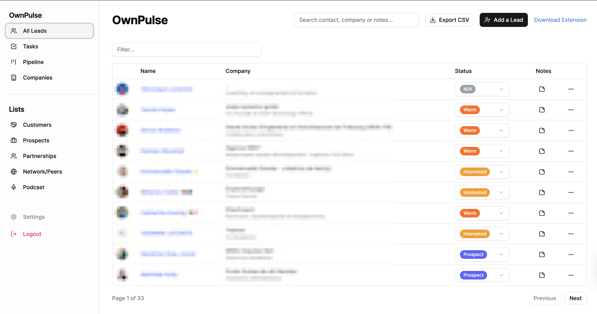

# 🛰️ OwnPulse
### **A Sovereign Social CRM for LinkedIn, Threads, and Instagram**



*Built by [Cedric V.](https://cedricv.com/en/) — Architecting efficient, self-hosted solutions.*

---

## 📖 About the Project

**OwnPulse** was born from a technical challenge: building a lightweight, sovereign alternative to modern Social CRMs. 

In the era of "Vibe Coding," I wanted to prove to myself that you can deconstruct a complex SaaS and rebuild the core 20% of features that deliver 80% of the value in record time. OwnPulse is designed for builders and entrepreneurs who want the power of a Social CRM without the monthly subscription or the data privacy concerns of third-party platforms.

> "Why subscribe to a cloud when you can own your pulse?"

## ✨ Key Features
- **Sovereign Dashboard:** High-velocity Next.js interface to manage your sales pipeline.
- **Advanced Analytics:** 
    - **Marketing Dashboard:** Track acquisition channels, conversion times, and lead-to-customer ratios.
    - **CFO Dashboard:** Real-time financial monitoring (Revenue, Expenses, Net Profit, Runway).
- **Business Simulation:** Simulate net profit after social contributions and taxes directly in the CFO dashboard.
- **Multi-Language Support:** Fully localized in **French** and **English**, with persistent user preferences.
- **One-Click Lead Capture:** Chrome Extension for LinkedIn, Threads, and Instagram profiles.
- **Modern UX:** Real-time feedback with debounced auto-save and date-range filtering.
- **Data Ownership:** Your data stays in your Supabase instance. No middlemen.

## 🛠️ Tech Stack
- **Frontend/Backend:** [Next.js 15](https://nextjs.org/) (App Router) + [Tailwind CSS](https://tailwindcss.com/)
- **Charts:** [Recharts](https://recharts.org/)
- **Database:** [Supabase](https://supabase.com/) (PostgreSQL + RLS)
- **i18n:** Custom React Context-based solution with Supabase persistence.
- **Integration:** Chrome Extension Manifest V3.
---

## 🚀 Getting Started

### 1. Database Setup (Supabase)
1. Create a free project on [Supabase](https://supabase.com).
2. Execute the SQL schema found in `/supabase/schema.sql` to initialize your `contacts`, `companies`, and `tasks` tables.
3. Retrieve your `SUPABASE_URL` and `SUPABASE_ANON_KEY`.
4. *Existing users:* If you are upgrading from a version before Threads/Instagram support, run `migration_social_fields.sql`.

### 2. Web App Installation (Local)
1. Clone the repository.
2. Go to the dashboard directory: `cd dashboard`.
3. Create a `.env.local` file:
   ```env
   NEXT_PUBLIC_SUPABASE_URL=your-supabase-url
   NEXT_PUBLIC_SUPABASE_ANON_KEY=your-supabase-anon-key
   ```
4. Install and run:
   ```bash
   npm install
   npm run dev
   ```

### 3. Extension Installation
1. Go to `chrome://extensions/`.
2. Enable **Developer Mode**.
3. Click **Load unpacked** and select the `/extension` folder from this repository.
4. Update the extension's configuration (in `popup.js` or `content.js`) with your Supabase endpoint.

---

## 📊 How it works
1. 📡 **Capture**: The Chrome extension scrapes the LinkedIn, Threads, or Instagram profile DOM securely.
2. ⚡ **Sync**: Data is sent instantly to your private Supabase PostgreSQL instance.
3. 🛰️ **Pulse**: Manage your relationships and pipeline stages via the OwnPulse dashboard.

---

## ⚖️ Legal Disclaimer

**IMPORTANT: READ THIS BEFORE USE.**
This project is for **educational and personal use only**. It is not affiliated with, authorized, maintained, sponsored, or endorsed by LinkedIn or its affiliates.
- **Compliance:** Using third-party extensions to modify platform behavior may violate Terms of Service of the respective platforms (LinkedIn, Threads, Instagram).
- **Risk:** Use this software at your own risk. The author is not responsible for any account warnings or suspensions.
- **No Warranty:** This software is provided "as is", without warranty of any kind.

---

## 📜 License
Distributed under the **BSD 3-Clause License**. See `LICENSE` for more information. This license protects the author's name from being used for endorsement of derivative works while allowing full freedom for personal and commercial use.
